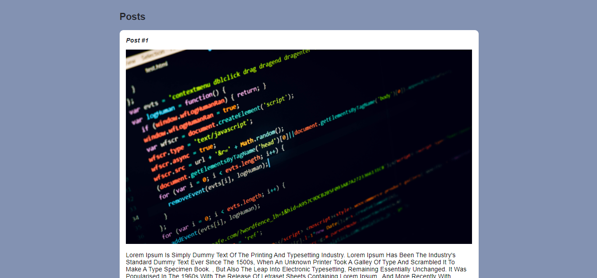

  <h1 align="center">📝 Introdução a criação de websites com HTML5 e CSS3  📝
</h1>

  

 
 
 

 

## 💻 Sobre o projeto

📝 Introdução a criação de websites com HTML5 e CSS3  📝

## 🛠 Tecnologias

As seguintes ferramentas foram usadas na construção do projeto seguindo o curso de Html e Css 3:

#### **Layout**

- **[HTML](https://www.w3schools.com/html/)**
- **[CSS](https://www.w3schools.com/css/)**

#### **Utilitários**

- Curso: **[ Digital Innovation One](https://digitalinnovation.one/sign-in?redirect=%2Fhome)**
- Editor: **[Visual Studio Code](https://code.visualstudio.com/)**
- Markdown: **[StackEdit](https://stackedit.io/)**, **[Markdown Emoji](https://gist.github.com/rxaviers/7360908)**

